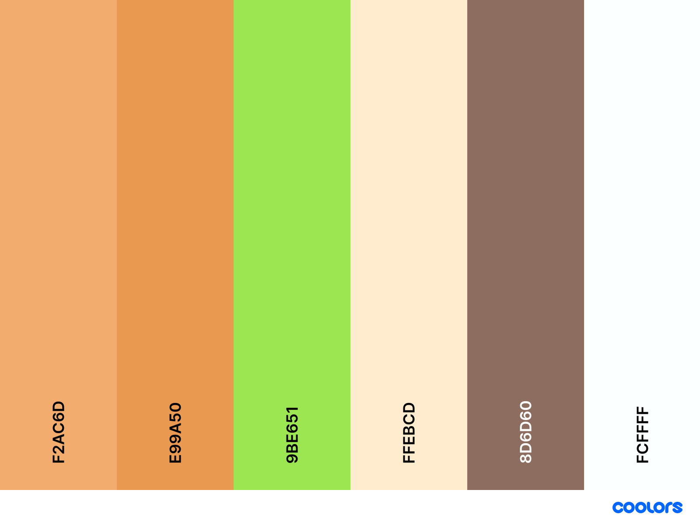
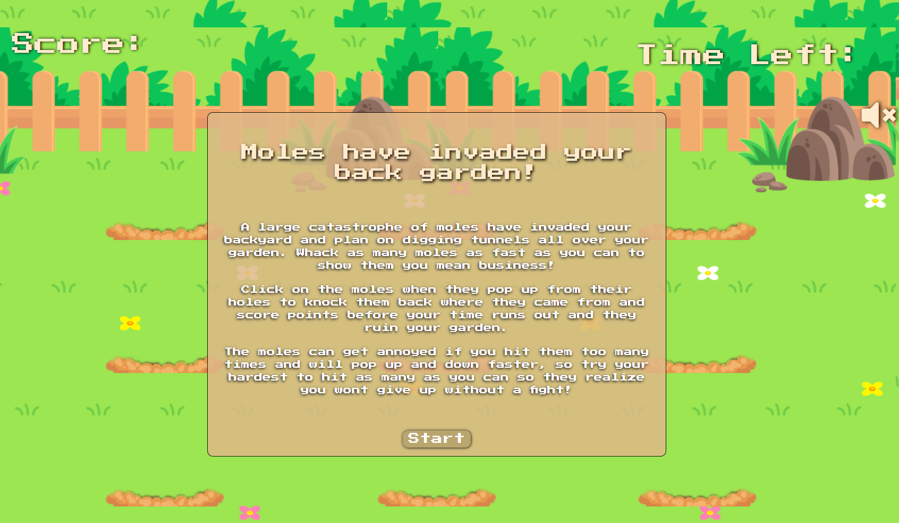
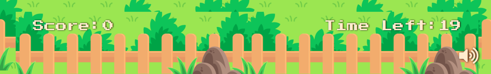

## Table of Contents

1. [**UX**](#ux)

   - [**Project Goals**](#project-goals)
   - [**User Goals**](#user-goals)
   - [**Developers goals**](#developer-goals)
   - [**User Stories**](#user-stories)
   - [**Design**](#design)
   - [**Wireframes**](#wireframes)

2. [**Technologies Used**](#technologies-used)

3. [**Features**](#features)

   - [**Existing Features**](#existing-features)
   - [**Features to Implement**](#Features-to-Implement)

4. [**Testing**](#testing)

5. [**Deployment**](#deployment)

6. [**Credits**](#credits)
   - [**Content**](#content)
   - [**Media**](#media)
   - [**Code**](#code)
     - [**Educational Credit**](#educational-credit)
   - [**Acknowledgements**](#acknowledgements)

## UX

#### Project Goals

The main goal of Whacka-mole is to give the user a fun, intuitive and addictive game with a growing level of difficulty as the game progresses.

#### User Goals

The players goals:

- An entertaining game that can help pass time.
- Nice images and sounds responsive to actions made by the user.
- Becomes more challenging the further the user gets in the game.
- Easily understood and intuitive to play.

#### Developer Goals

- Build a small game that I would enjoy playing to past the time and also challenge myself.
- Write clean code using JavaScript and jQuery to allow the game to function without issues and also allow others to see how the code works with inline comments on block of code.
- Create a new project to add to my portfolio to showcase my ability.

#### User Stories

As the user of this application I want:

1. To have instructions on how to play the game and what the rules may be.
2. The ability to mute any sounds that would be playing in the background.
3. To be able to see my current and high score.
4. increase the level of difficulty as the I progress through the game.
5. A visually appealing game.
6. The ability to play this game on multiple devices.

### Design

**Colors**

- The theme of this game revolves heavily around moles and my aim was to achieve an earthy look and feel with the color scheme.

**Styling**

- Font used in this Project is [Press Start 2P](https://fonts.google.com/specimen/Press+Start+2P#standard-styles) This font was used to give the game a retro feel but contrasts nicely with the background image and sprites.

- Main color pallet used Throughout the game 

- Text Shadow was applied to both the .countdown-timer and .score containers to give the appearance that they are lifted from the image and floating above in the air.

**Background**

- The background image/colors used were to help make the game feel like it is played on the ground with the moles digging underneath the soil and popping up before being bonked on the head.

**Sprites**

- The game uses 4 mole Sprites. The first sprite is an innocent looking mole that appears from within the hole. The second sprite is used for when the user hits the mole to the give effect the mole has be bonked. The third sprite is used when the user gets to a certain score and the gameplay increases in speed and the mole image is changed to make them look mad. The last mole is used for the final difficulty which increases the speed again after a certain score is reached and the new mole image makes them look very angry to give the use the sense that whacking the moles is actually bothering them.

- A sprite of a mole hole was edited with [pixlr](https://pixlr.com/x/) and was used to overlay the mole sprite to assist in the appearance of the mole descending underground.

**Audio files**

- Audio plays in the background on a loop until the game ends as without the audio the game feels very one dimensional, the audio adds some sub-conscious entertainment and keeps the player more immersed.

  > _"Nacke, Grimshaw and Lindley asked participants to play a fast-paced, immersive first-person shooter (FPS) game modification, in which sound (on/off ) and music (on/off ) were manipulated. Result showed that more positive or neutral dimensions of the experience were experienced more positively when the sound of the game was playing."_

  - The full research paper is linked here [Journal of Psychology & Psychotherapy](https://www.longdom.org/open-access/the-influence-of-background-music-of-video-games-on-immersion-2161-0487-1000191.pdf)

- A snippet of audio that plays when the user hits a mole before they re-enter the hole to add a feeling of success and allow the user to acknowledge that they hit a mole correctly.

###

The wireframes were created using [Balsamiq](https://balsamiq.com/) during the design process of this project.

## Features

### Existing Features

#### 1. User info card

- When the page is loaded up for the first time, the user will be greeted with a pop-up card.
- This card will explain how the game is played
- When the window reloads the popup will show again.
- When the start button is pressed the game begins

#### 2. Info display and mute button

- On the top left of the page there is a score counter that increments every time the user successfully whacks a mole.
- On the top right of the page there is a timer that displays the amount of time left and decreases every second.
- Just below the countdown timer there is a mute button that stops the background audio playing when pressed. The icon used changes when clicked to signify the action taken.

#### 3. Start Button

- The start button is presented on the user info card when the window is first loaded.
- It has :hover and :active CSS to allow the user to know that they are hovering over it and when pressed.

#### 4. Gameplay and audio

- When the game begins there is background music that will play on a loop at its intended play rate.
- When the user reaches 5 points the speed at which the moles pop up and down at a faster rate. The image used for the moles changes to give them an appearance that they've become agitated. the background music also increases in speed slightly to match the speed of the moles.
- Finally when the user reaches 10 points the speed of the moles and music increases again to add more difficulty. The image changes again to show that the moles are very angry.
- To keep the user playing the game as long as possible 10 seconds are incremented every 10 points scored. This only happens when the hardest difficulty is on and it was made that way so if the user misses a few moles they will struggle to get an extra 10 seconds to keep playing adding to the challenge.
- There is a different mole image added when a mole is whacked along with a snippet of audio to indicate when the user successfully hits a mole.

#### 5. Replay button

- The replay button is displayed on the end-game card when the game finishes and has the same CSS features as the start button.
- When clicked the game score will start at 0 and the timer will begin at the original time and the easiest difficulty will be played.
- The replay button doesn't refresh the window so the user-info popup doesn't display to keep the user more engaged with the game.

### Features to Implement

#### 1. Highscore leaderboard

- In the future a leader board will be added to keep record of the users highscore.

#### 2. Another difficulty

- Add a "chaos" level of difficulty where there would be moles popping up from multiple holes at once as high speeds.

#### 3. Use sprite sheet animation

- Using a sprite sheet would give a better "flow" to the game by making the animation and appearance of the moles coming up from the ground look more realistic and also cut down heavily on calls to individual images reducing the load times.

## Technologies Used

- This project used HTML5, CSS3 and JavaScript.
- [jQuery](https://jquery.com/)
  - Used in this project to simplify manipulation of the DOM.
- [BootStrap](https://getbootstrap.com/docs/4.6/getting-started/introduction/)
  - Used to simplify the structure of this project and assist in responsiveness.
- [FontAwesome](https://fontawesome.com/)
  -Used in this project to place icons on the mute button.
- [Google Fonts](https://fonts.google.com/)
  - Used in this project to style the text.
- [VScode](https://code.visualstudio.com/)
  - This developer used VScode as the IDE to build the game.
  - **Prettier** extension used to help with formatting code.
  - **Spell Right** was used to assist with spell checking.
- [GitHub](https://github.com/)
  - This project used GitHub to store project code.

## Testing

All testing of this project can be found here on [testing.md](testing.md) on a separate file.

## Deployment

This project was developed using [VScode](https://code.visualstudio.com/), committed to [git](https://git-scm.com/) and pushed to [GitHub](https://github.com/).

To deploy Whacka-mole to GitHub Pages from its [repo](https://github.com/bozy15/ms2-whacka-mole) these are the steps to take.

1. Log in to GitHub.
2. From the list of repos choose **bozy15/ms2-whacka-mole**
3. Near the top of the page there will be the menu items, click on **Settings**
4. On the left side of the screen there is another list of items.
5. Scroll down to the second last item which will be **Pages** and select it.
6. Under **Source** click the dropdown menu and select **Master**
7. Once selected the link will appear in a matter of seconds to the live site.

### How to run this project locally

To clone this project:

1. Click this link to the [Whacka-mole](https://github.com/bozy15/ms2-whacka-mole) repo.
2. Under the menu items, there is a green button labelled **Code**.
3. Click the **Code** button and under the **Clone** option select the **HTTPS** tab.
4. Copy the clone URL for the repo.
5. In Your IDE open Git
6. Change the current directory to the location you want to clone this repo.
7. Type **git clone** followed by the copied URL.
8. Press Enter and your clone will be created.

## Credits

### Media

#### Images

- Mole sprite sheet is open source content retrieved from [lepunk](https://github.com/lepunk/react-native-videos/blob/whack-a-mole/WhackAMole/assets/img/sprites.png) and is free to use.

- Background image was sourced from [lepunk](https://github.com/lepunk/react-native-videos/blob/whack-a-mole/WhackAMole/assets/img/background.png) and is free to use.

#### Audio

- Audio used for whacking moles was taken from [FreeSound](https://freesound.org/people/Qat/sounds/114684/)

- Background music taken from [chosic](https://www.chosic.com/download-audio/?t=24995&tag=Games) and was created by Komiku.

### Code

- Function on line 2 of main.js taken from [StackoverFlow](https://stackoverflow.com/questions/1012140/delaying-a-jquery-script-until-everything-else-has-loaded) written by Jose Basilio

- How to play audio in JavaScript was taken from [StackoverFlow](https://stackoverflow.com/questions/9419263/how-to-play-audio) written by Uri.

- How mute and unmute audio was taken from [StackoverFlow](https://stackoverflow.com/questions/7798530/mute-and-unmute-button-toggle-html5-audio/7798585#7798585) written by Esailija.

- How to store objects to local storage was taken from [stackoverFlow](https://stackoverflow.com/questions/2010892/storing-objects-in-html5-localstorage) written by Christian C. Salvadó

How to build a highscore leader board was greatly assisted by [James Q quick](https://www.youtube.com/watch?v=DFhmNLKwwGw)

#### Educational Credit

- [Code Institute](https://www.codeinstitute.net/) Where 99% of this developers knowledge of JavaScript comes from.

- [DailyJS](https://medium.com/dailyjs/how-to-build-a-simple-sprite-animation-in-javascript-b764644244aa) For helping with this developer to understand how to animate a sprite sheet and why its more efficient.

- [CSS-tricks](https://css-tricks.com/best-way-implement-wrapper-css/) Clarifying why to use wrapper class over container class.

- [w3schools](https://www.w3schools.com/tags/av_prop_playbackrate.asp) How to increase playback speed.

- [Mozilla](https://developer.mozilla.org/en-US/docs/Web/JavaScript/Reference/Global_Objects/Array/sort) How to sort through an objects values.

### Acknowledgements

- This developer's Mentor Caleb Mbakwe, who showed me the right path to go down when developing this project.

- Sean Young at Code Institute who was lead of the interactive-frontend channel at the time of this projects creation and helped guide this developer in the right direction when trying to increase difficulty while playing the game.

### Content

- All text was written by Emmett Becirovic.
